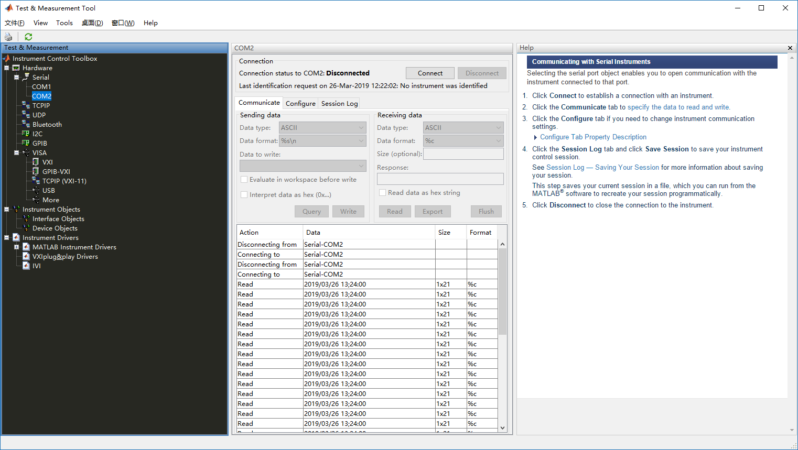

# MATLAB GUI 串口数据读取显示程序

## 串口数据接收

在 MATLAB 里面进行串口通信还是比较简单的，如果不想要个性化，完全是可以通过一个 Text&Mesurement Tool 大的工具箱进行的，工具箱界面如下。



在这里，可以自己连接对应的串口收发数据。

下面是在代码下进行串口收数据。

首先需要初始化串口， `serial` 是一个类，第一行代码也就是相当于实例化了。

`set` 和 `get` 的用法跟在 C# 里面的十分类似，`get` 是得到属性列表及其值，`set` 是设置属性，当然，对于公共属性，使用点运算符也是可以的。

下面的 `for` 循环其实是应该要在 GUI 里面写成死循环的，因为串口的收数据应该是不能停的，不然 `for` 循环只有几次是不行的。`fprintf(s,'*IDN')` 这是一个标准的`*IDN?` 命令用于查询设备的标识信息，该信息将被返回到 `out`。如果您的设备不支持此命令，或者它被连接到其他串行端口，需要相应地修改。

串行端口会话包含在与连接到串行端口的设备通信时可能需要执行的所有步骤。这些步骤包括：

找到您的串行端口 - 使用 seriallist 函数显示系统上的串行端口列表。
创建串行端口对象 - 使用 serial 创建函数为特定的串行端口创建串行端口对象。
如有必要，请在对象创建期间配置属性。特别是，您可能要配置与串行端口通信相关的属性，例如波特率、数据位数等等。
连接到设备 - 使用 fopen 函数将串行端口对象连接到设备。
连接对象后，通过配置属性值修改必要的设备设置，读取数据以及写入数据。
配置属性 - 要建立所需的串行端口对象行为，请使用 set 函数或圆点表示法为属性赋值。
实际上，您可以随时（包括在对象创建期间或刚刚创建后）配置多种属性。反过来，根据您的设备设置和串行端口应用程序的要求，您可以接受默认属性值并跳过此步骤。
写入和读取数据 - 使用 fprintf 或 fwrite 函数将数据写入设备，以及使用 fgetl、fgets、fread、fscanf 或 readasync 函数从设备读取数据。
串行端口对象的行为取决于之前配置的属性值或默认属性值。
断开连接并清理 - 当您不再需要串行端口对象时，使用 fclose 函数从设备断开该对象，使用 delete 函数从内存中删除该对象，以及使用 clear 命令从 MATLAB® 工作区删除该对象。

Demo 代码如下：

```matlab
s = serial('COM2');     %///////////// 设置端口为 COM2
set(s,'BaudRate',9600); % 设置波特率为 9600
fopen(s);               % 打开端口
% 读取数据并保存至元胞数组 A
for i=1:1:10
    fprintf(s,'*IDN?');
    out = fscanf(s);
    A{i}=cellstr(out);
	disp(out)
end
fclose(s);
delete(s)
clear s
```

## 接收数据预处理

接收的数据格式为 ：

数据帧结构：帧头+数据+帧尾 共68字节，字符型数据，不同类型数据之间采用‘，’分隔。
START,A017,3031.07100N,10404.00096E,181213101431,658038464,0295,STOP
帧头：START
地址编码：A017 A组，017号
纬度信息：3031.07100N 北纬30°31′7.100″
经度信息：10404.00096E东经104°4′0.096″
UTC时间：181213101431  格林威治时间2018年12月13日10时14分31秒
触发时刻：658038464  触发时刻精确细时间为658,038,464ns
能量：0295    能量十进制量化值，未经处理，范围0~4095
帧尾：STOP

所以需要对读到的数据进提取。

首先要以逗号为分隔符，得到不同的每个部分的数据，这个就使用正则表达式 `regexp` (regular expression)来进行处理，这里是读入数据，得到得到一个数据分割出来的元胞数组 `DataCellArr`，首先检查数据的头尾是否正确。再进行提取数据，当然用元胞数组一个个提取出来的都是字符串，后面的提取数值也就是对于字符串的处理与转化。这部分不难。

Demo 代码如下：

```matlab
str = 'START,A017,3031.07100N,10404.00096E,181213101431,658038464,0295,STOP';
% 正则表达式分割数组
DataCellArr = regexp(str,',','split');
START = DataCellArr{1};
STOP = DataCellArr{8};
% 判断帧头帧尾是否完整
if((START == "START" ) && (STOP == "STOP"))
    disp('data is security');
else
    disp('data is not security');
end
% 取出数据
AddressCode = DataCellArr{2};
LatitudeBefore = DataCellArr{3};
LongitudeBefore = DataCellArr{4};
UTCDateTimeBeefore = DataCellArr{5};
TriggerTimeBefore = DataCellArr{6};
PowerBefore = DataCellArr{7};
% 把取出的原始数据转化为有用的信息
[PositionLatStr,PositionLatNum] = getLatitude(LatitudeBefore);
[PositionLonStr,PositionLonNum] = getLongitude(LongitudeBefore);
UTCDateTime = getTime(UTCDateTimeBeefore);
TriggerTimeArr = getTriggerTime(TriggerTimeBefore);
Power = getPower(PowerBefore);
```

## 数据显示

这里就是用 GUI 界面来集成串口数据的收和可视化工作。

使用一个 `uitable` 来显示数据。

上图。

## 数据计算