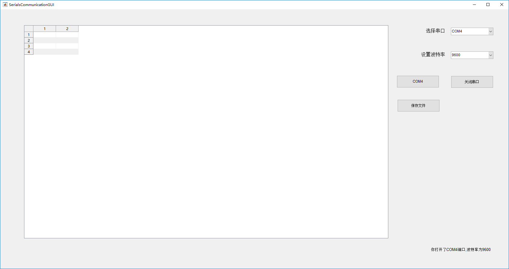
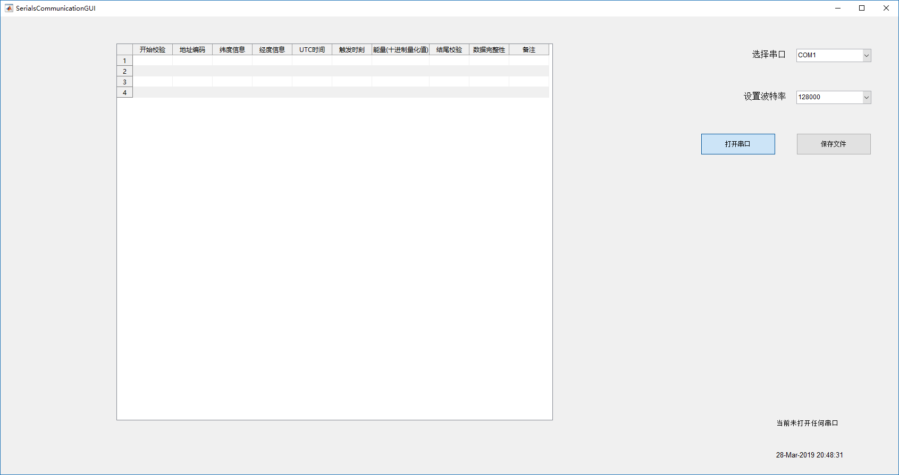
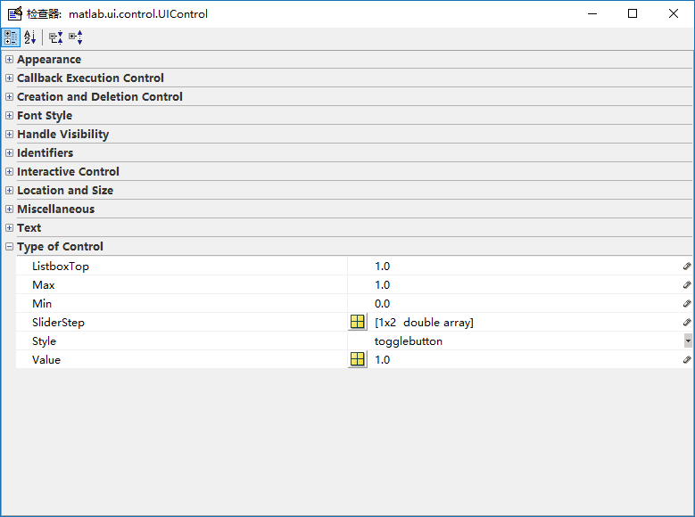
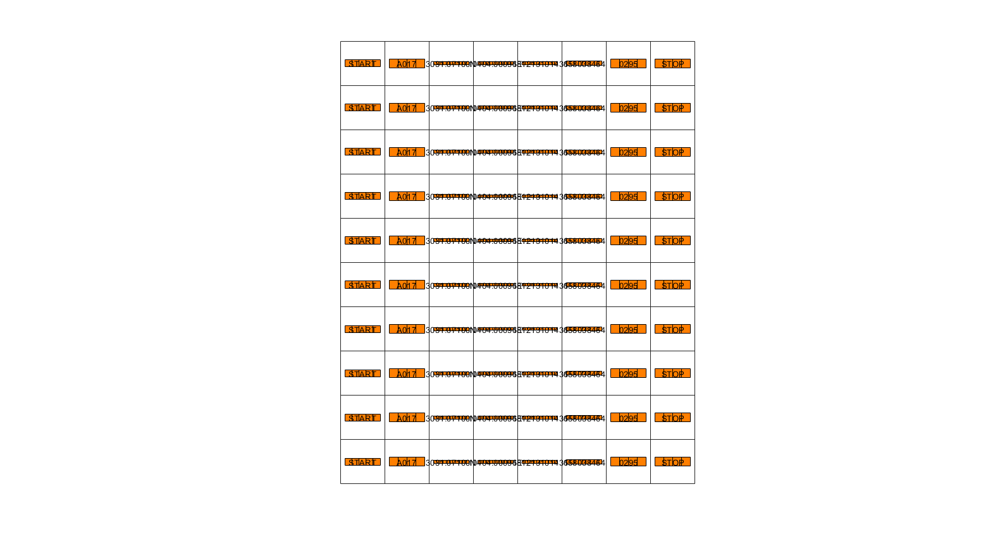
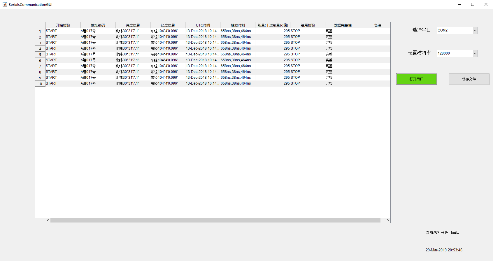
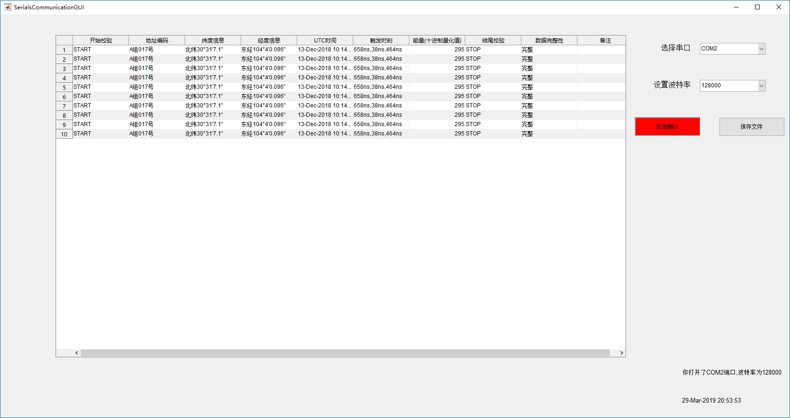
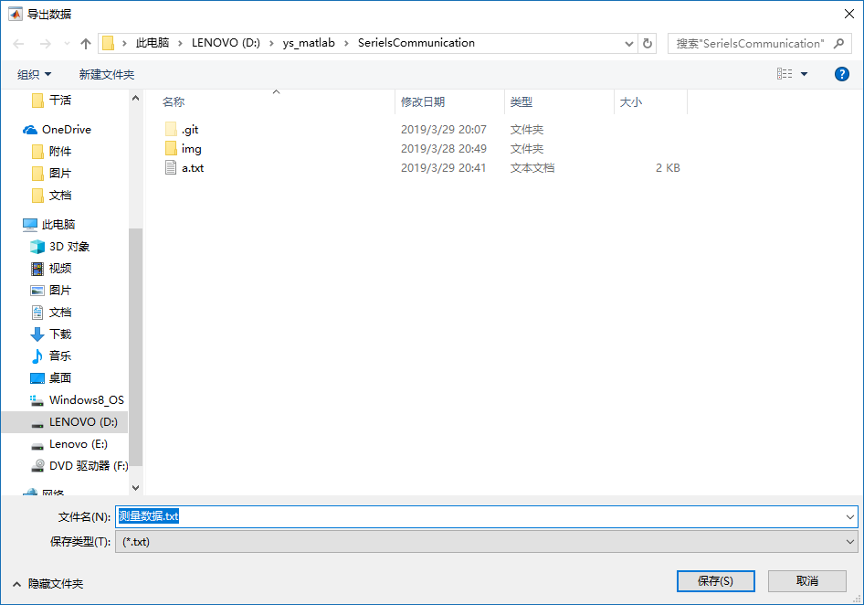
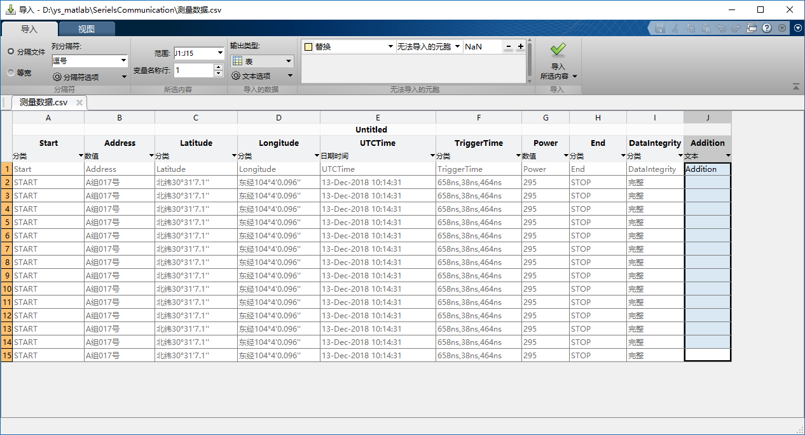

# MATLAB GUI 串口数据读取显示程序

## 串口数据接收

在 MATLAB 里面进行串口通信还是比较简单的，如果不想要个性化，完全是可以通过一个 Text&Mesurement Tool 大的工具箱进行的，工具箱界面如下。


在这里，可以自己连接对应的串口收发数据。

下面是在代码下进行串口收数据。

首先需要初始化串口， `serial` 是一个类，第一行代码也就是相当于实例化了。

`set` 和 `get` 的用法跟在 C# 里面的十分类似，`get` 是得到属性列表及其值，`set` 是设置属性，当然，对于公共属性，使用点运算符也是可以的。

下面的 `for` 循环其实是应该要在 GUI 里面写成死循环的，因为串口的收数据应该是不能停的，不然 `for` 循环只有几次是不行的。`fprintf(s,'*IDN')` 这是一个标准的`*IDN?` 命令用于查询设备的标识信息，该信息将被返回到 `out`。如果您的设备不支持此命令，或者它被连接到其他串行端口，需要相应地修改。

串行端口会话包含在与连接到串行端口的设备通信时可能需要执行的所有步骤。这些步骤包括：

找到您的串行端口 - 使用 seriallist 函数显示系统上的串行端口列表。
创建串行端口对象 - 使用 serial 创建函数为特定的串行端口创建串行端口对象。
如有必要，请在对象创建期间配置属性。特别是，您可能要配置与串行端口通信相关的属性，例如波特率、数据位数等等。
连接到设备 - 使用 fopen 函数将串行端口对象连接到设备。
连接对象后，通过配置属性值修改必要的设备设置，读取数据以及写入数据。
配置属性 - 要建立所需的串行端口对象行为，请使用 set 函数或圆点表示法为属性赋值。
实际上，您可以随时（包括在对象创建期间或刚刚创建后）配置多种属性。反过来，根据您的设备设置和串行端口应用程序的要求，您可以接受默认属性值并跳过此步骤。
写入和读取数据 - 使用 fprintf 或 fwrite 函数将数据写入设备，以及使用 fgetl、fgets、fread、fscanf 或 readasync 函数从设备读取数据。
串行端口对象的行为取决于之前配置的属性值或默认属性值。
断开连接并清理 - 当您不再需要串行端口对象时，使用 fclose 函数从设备断开该对象，使用 delete 函数从内存中删除该对象，以及使用 clear 命令从 MATLAB® 工作区删除该对象。

Demo 代码如下：

```matlab
s = serial('COM2');     %///////////// 设置端口为 COM2
set(s,'BaudRate',9600); % 设置波特率为 9600
fopen(s);               % 打开端口
% 读取数据并保存至元胞数组 A
for i=1:1:10
    fprintf(s,'*IDN?');
    out = fscanf(s);
    A{i}=cellstr(out);
	disp(out)
end
fclose(s);
delete(s)
clear s
```

## 接收数据预处理

接收的数据格式为 ：

数据帧结构：帧头+数据+帧尾 共68字节，字符型数据，不同类型数据之间采用‘，’分隔。
START,A017,3031.07100N,10404.00096E,181213101431,658038464,0295,STOP
帧头：START
地址编码：A017 A组，017号
纬度信息：3031.07100N 北纬30°31′7.100″
经度信息：10404.00096E东经104°4′0.096″
UTC时间：181213101431  格林威治时间2018年12月13日10时14分31秒
触发时刻：658038464  触发时刻精确细时间为658,038,464ns
能量：0295    能量十进制量化值，未经处理，范围0~4095
帧尾：STOP

所以需要对读到的数据进提取。

首先要以逗号为分隔符，得到不同的每个部分的数据，这个就使用正则表达式 `regexp` (regular expression)来进行处理，这里是读入数据，得到得到一个数据分割出来的元胞数组 `DataCellArr`，首先检查数据的头尾是否正确。再进行提取数据，当然用元胞数组一个个提取出来的都是字符串，后面的提取数值也就是对于字符串的处理与转化。这部分不难。

Demo 代码如下：

```matlab
str = 'START,A017,3031.07100N,10404.00096E,181213101431,658038464,0295,STOP';
% 正则表达式分割数组
DataCellArr = regexp(str,',','split');
START = DataCellArr{1};
STOP = DataCellArr{8};
% 判断帧头帧尾是否完整
if((START == "START" ) && (STOP == "STOP"))
    disp('data is security');
else
    disp('data is not security');
end
% 取出数据
AddressCode = DataCellArr{2};
LatitudeBefore = DataCellArr{3};
LongitudeBefore = DataCellArr{4};
UTCDateTimeBeefore = DataCellArr{5};
TriggerTimeBefore = DataCellArr{6};
PowerBefore = DataCellArr{7};
% 把取出的原始数据转化为有用的信息
[PositionLatStr,PositionLatNum] = getLatitude(LatitudeBefore);
[PositionLonStr,PositionLonNum] = getLongitude(LongitudeBefore);
UTCDateTime = getTime(UTCDateTimeBeefore);
TriggerTimeArr = getTriggerTime(TriggerTimeBefore);
Power = getPower(PowerBefore);
```

## 数据显示

这里就是用 GUI 界面来集成串口数据的收和可视化工作。

使用一个 `uitable` 来显示数据。

GUI 的设计大概如下，当然还会再添加一些其他的有关串口通信需要的属性，今天先这样吧，就做到这儿吧。

​						<!--DateTime ---2019.3.26  23：00-->



计划实现的功能是完成串口通信的属性设置和数据读取显示在 `uitable` 上面。提示信息会在右下角显示。

刚刚看了一下数据在 table 里面的存储格式，是使用元胞数组格式存储的，所以我在写入表格前，应该把数据都存储为一个二维元胞数组，数据的行代表每个字符串解析出来的数据，列也就是一个字符串里面的每个部分的含义。

**修改 GUI**

- 今天看到有个 `Toggle Button` 的 `UI Control` 对象，就发现可以使用这个按钮来显示打开和关闭状态，这个按钮的着色后期也是可以解决的，按钮的切换是两种状态，对应的是三个值 `Value，Max，Min` ，`Max，Min` 分别是 0 和 1，`Value`是根据状态来取其中的值的，所以可以对应按钮的按下和弹起两种，也就是可以对应打开串口和关闭串口两种状态。
- 增加了时间显示，这个显示说来其实也不难，MATLAB 的 UI 里面有个对象叫 `Timer`定时器，可以设置定时器的触发周期，触发模式和触发之后的回调函数。在这里将触发器的触发周期设置为 1s，也就是相当于是每秒就会更新一下时间，这跟我们平时看到的时钟是一致的。当然触发模式要设置为 `FixedRate` ，这是一种比较精确的触发模式，也可以周期性循环触发。在回调函数里面就要设置触发之后要怎么作，在这里当然是更新时间了，也就是读取当前的时间将其写入到某个静态文本即可。当然，最后别忘了在窗口关闭的回调函数上面将定时器关闭。





设计的元胞数组保存数据格式如下



今天终于把这些都完成了。

<!--DateTime:2019/3/29 20:56:34-->

最后的成品是这样的，当一打开软件的时候，会有一个空白的表格，一个选择端口，一个选择波特率，一个开关串口的 `ToggleButton` 和一个保存文件的 `PushButton` 按钮。

在串口关闭的时候，串口开闭按钮的背景色 `BackgroundColor` 是绿色的，这里是直接在 GUIDE 里面设置的 RGB 的值，这个值只要是鼠标放上去就会显示出来，然后把这个颜色值拿出来放在关闭的时候触发就可以了，当然一进去的时候串口肯定是关闭状态的。



打开串口之后是这样的。串口的状态按钮背景色 `BackgroundColor` 变成了红色，而且按钮上面的字符 `String` 也随之改变，这个实现起来也是很简单的。使用一条 `set` 语句就可以了，需要注意的是这里的所有 `uicontrol` （UI控件）都是handles(结构体)的子类（不知道怎么说这个关系，就是访问的时候需要加上 `.`）。例如：

```matlab
set(handles.tblShowData,'ColumnWidth',{120});
data = get(handles.tblShowData,'Data');
data([1:4],:) = [];
set(handles.tblShowData,'Data',data);
% 传递端口和波特率设置数据
str = get(handles.mnChoosePort, 'String');
val = get(handles.mnChoosePort,'Value');
% 判断选了哪个端口
handles.port_data = getPort(str{val});
str = get(handles.mnChooseBaud, 'String');
val = get(handles.mnChooseBaud,'Value');
```

这里的 `tblShowData` 是表格的 `tag`（table show data），`mnChoosePort，mnChooseBaud` ，分别是选择端口和波特率的下拉菜单。



打开串口，如果收到数据，就会显示在表格上，这个是通过一个时间机制来实现的，这是初始化串口的代码，这里面的最后一句是注册了时间，说明在 `BytesAvailable` 发生的时候触发 `BytesAvailableFcn` 函数 `bytes` ，这个 `@`是代表取到函数句柄的意思， `handles，obj，events`都会被传入，但是这里只是看到了一个 `handles`，那是因为在触发时间的时候已经可以知道是哪个对象传入和哪个时间触发，在这里就不用重复写了。

```matlab
handles.scom = serial(handles.port_data);       % 新建串口
set(handles.scom,'BaudRate',handles.baud_data); % 设置波特率
set(handles.scom,'BytesAvailableFcnCount',69);
set(handles.scom,'BytesAvailableFcnMode','byte');
set(handles.scom,'BytesAvailableFcn',{@bytes,handles});
```

之后在 `saveFile`按钮的回调函数下面写了一个存储到文件的功能，这个实现也不是很难。

只需要首先调用 `uiputfile`函数说明需要打开一个写文件窗口，之后再把文件写入。

这里需要注意的是文件写入有个问题，其实在 **MATLAB2019a** 里面已经有了一个叫做 `cellwrite`函数了，这个函数可以直接把元胞数组的数据写入到其他格式的文件中，格式在下面的代码的注释里面也体现了。但是我现在的版本还差半个，是 **MATLAB2018b** ，所以这个函数无法使用，那么只要使用原来的函数来实现功能。

这里我觉得一种比较简便的方法是使用 `cell2table` 函数将元胞数组的数据转化为表格数据，最终使用表格数据有的写文件函数 `writetable` 把数据写到文件里面，表格数据的导出会将表格的列名称也导出，但是列名称在表格中实际上是属性名，所以不允许出现中文，这里就使用了英文来代替。

```matlab
[FileName,PathName] = uiputfile({'*.txt';'*.csv'},...
    '导出数据','测量数据.txt');
Data = get(handles.tblShowData,'Data');
DataTable = cell2table(Data);
VarName = {'Start','Address','Latitude','Longitude','UTCTime',...
            'TriggerTime','Power','End','DataIntegrity','Addition'};
DataTable.Properties.VariableNames = VarName;
file = strcat(PathName,FileName);
writetable(DataTable,file);
% 2019a版本有这个函数 writecell
% writecell(Data,file,'Delimiter',',')
```



最终导出的文件格式其实可以有很多，只要设置好数据的格式就能导出需要的格式，这里仅写了两种格式导出功能`.csv`和 `.txt`，最终的写出来的数据是这样的。这边是使用 MATLAB 顺便打开，结果就是这样的。



## 数据计算

这个暂时含没有要数据处理的需求，可能以后会有，但是凭借 MATLAB 的强大的科学计算能力，应该做一些数据计算可视化不在话下。